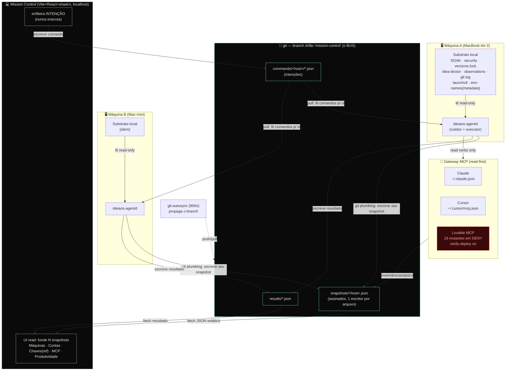

# IdeiaOS Mission Control — Arquitetura de Sistema

> **Documento:** `20-architecture.md`
> **Persona:** Staff/Principal Architect
> **Status:** PROPOSTO (zero código)
> **Data:** 2026-06-20
> **Escopo:** Arquitetura do console/CTO de comando e gestão sobre TODO o ecossistema IdeiaOS.
> **Princípio-guia:** `enforce-simplicity` — reusar substrato existente (git, ledgers, idea-doctor) ANTES de inventar backend novo.

---

## 0. TL;DR — a decisão em um parágrafo

O Mission Control é **local-first, com git como bus de federação cross-máquina, e ZERO backend cloud novo**. Cada máquina roda um **agente local** (um daemon Node.js leve, irmão do `git-autosync`) que lê o substrato que o IdeiaOS *já* coleta — SOAK ledger, security ledger, `versions.lock`, `idea-doctor`, observations JSONL, git log — normaliza tudo num **snapshot JSON assinado** e o commita num **branch órfão `mission-control`** (mesmo mecanismo do branch `planning`). O console é um **app Vite+React+TS+shadcn/ui** (o stack canônico dos 4 produtos), servido localmente, que lê os snapshots de TODAS as máquinas via git e os funde no navegador. O **control-plane** (ações privilegiadas: pausar autosync, rodar doctor, gravar selo de segurança) é mediado pelo agente local via uma fila de comandos versionada — nunca pelo navegador direto. O **gateway MCP** (Lovable/Cursor/Claude) é **read-first por construção**: reusa a deny-list de 19 tools mutantes já enforçada e a skill `lovable-mcp.sh`. **Credential-isolation é lei**: o console é control-plane/metadata (existe? idade? escopo? last-used?), NUNCA cofre de plaintext.

**Por que não cloud:** o substrato de sync já existe (git + autosync + branch `planning`). Adicionar Supabase/backend HTTP seria reinventar o bus, adicionar superfície de credencial, e violar `token-economy` (CLI/git antes de serviço novo). O único custo que git-as-bus impõe — latência de ~900s entre snapshot e visibilidade cross-máquina — é **aceitável** para um console de CTO (visão estratégica, não monitoramento sub-segundo).

---

## 1. Restrições e forças que moldam a decisão

Antes de desenhar, declaro as **suposições materiais** (conduta `surface-assumptions`). Corrija agora ou sigo com elas:

1. **O console é uma ferramenta interna de UMA pessoa-fronte (o CTO) + equipe pequena**, não um SaaS multi-tenant. Não há requisito de auth multi-usuário externo, nem de uptime 99.9%, nem de acesso fora das máquinas do dono.
2. **As máquinas são poucas e conhecidas** (hoje 2: MacBook-Air-2, Mac-mini-de-Gustavo). A federação não precisa escalar para centenas de nós — precisa ser correta e auditável para ~2–5 máquinas.
3. **A visão é estratégica, não operacional-em-tempo-real.** "Quantas máquinas saudáveis, qual o frescor de segurança, qual a velocity humana por produto, quais chaves existem" — perguntas de minutos/horas, não de milissegundos. Latência de propagação de ~15min (ciclo autosync) é tolerável.
4. **O substrato já existe e é confiável.** Os 7 sources do recon (SOAK, security ledger, versions.lock, idea-doctor, observations, git log, LaunchAgents) são determinísticos, legíveis sem LLM, e já commitados/cross-máquina onde importa.
5. **Credential-isolation é inegociável** (rule-piso). Nenhum valor de segredo transita pelo console — nem no front, nem no snapshot, nem em log.

### Forças em tensão (e como resolvo cada uma)

| Força | Tensão | Resolução |
|-------|--------|-----------|
| **Visibilidade cross-máquina** | máquinas não se enxergam ao vivo | git como bus: cada máquina commita seu snapshot; todas leem todos |
| **Simplicidade** vs **federação** | backend resolveria federação "de graça" | git JÁ é o backend de federação — reusá-lo é mais simples que adicionar um 2º |
| **Ações privilegiadas** vs **segurança** | navegador não pode rodar `launchctl`/`git` | agente local executa; navegador só enfileira intenção (command queue) |
| **Frescor** vs **latência git** | 900s é lento para "agora" | snapshot tem 2 horizontes: *local* (lido direto do FS, instantâneo) + *remoto* (via git, ~15min) |
| **MCP poderoso** vs **read-first** | Lovable/Cursor têm tools mutantes | deny-list de 19 tools já enforçada; gateway só expõe verbos read |

---

## 2. A decisão central: LOCAL-FIRST com git-as-bus

### 2.1 Os três caminhos avaliados

#### Caminho A — Local-first puro com git como bus  ✅ ESCOLHIDO
Cada máquina roda um agente local que escreve snapshots num branch git dedicado. O console lê do git. Nenhum serviço de rede novo.

- **Prós:** zero backend novo; reusa autosync/branch-órfão (padrão `planning` já provado); auditável (todo snapshot é um commit assinável); offline-capable; custo operacional ~zero; alinhado a `token-economy` e `enforce-simplicity`.
- **Contras:** latência de propagação ~15min (ciclo autosync); sem push real-time; "máquina offline" só aparece como "snapshot velho" (mitigável com heartbeat staleness).

#### Caminho B — Cloud (Supabase) como hub de telemetria  ❌ REJEITADO
Cada agente local faz `POST` de telemetria para uma tabela Supabase; o console é um app que lê dessa tabela.

- **Prós:** real-time (Supabase Realtime); federação trivial; query SQL rica.
- **Contras (fatais aqui):**
  - **Reinventa o bus** — git+autosync já federa; adicionar Supabase é um 2º mecanismo de sync paralelo, com drift garantido entre os dois.
  - **Nova superfície de credencial** — exige `SUPABASE_SERVICE_ROLE_KEY` (a chave de MAIOR risco do ecossistema, per recon) num daemon de telemetria. Isso é exatamente o anti-padrão que `credential-isolation` proíbe.
  - **Viola `token-economy`** ("antes de adicionar MCP/serviço, cheque CLI/git/skill"). O outcome — federação de snapshots — é 100% atingível via git.
  - **Custo recorrente e dependência de rede** para uma ferramenta que o dono usa nas próprias máquinas.

#### Caminho C — Híbrido (local-first + cloud opcional para histórico/alerta)  ⏸️ PARQUEADO (futuro)
Local-first como base; um relay cloud opcional só para (a) histórico de longo prazo além do git, e (b) push notification quando uma máquina fica `egregious`/offline.

- **Veredito:** **não no v1.** É a evolução natural SE/QUANDO surgir necessidade de alerta fora-da-máquina ou retenção > git. O design do Caminho A é deliberadamente **híbrido-ready**: o snapshot JSON assinado é o contrato; um relay cloud futuro só precisa consumir o mesmo snapshot. Não construir agora (YAGNI), mas não fechar a porta.

### 2.2 Por que git-as-bus é a escolha certa AQUI (e não dogma)

`enforce-simplicity` não é "sempre o mais simples" — é "a solução chata que o substrato já paga". O IdeiaOS **já** tem:

- Um daemon de sync por máquina (`git-autosync`, 900s, protege main pull-only).
- Um padrão de branch-órfão para dados cross-máquina (`planning`: STATE/ROADMAP/SOAK/memória).
- Ledgers commitados que SÃO telemetria cross-máquina (SOAK `.planning/soak/*.log`).
- Gates determinísticos com exit-code (`check-soak.sh`, `check-security-freshness.sh --tier`, `idea-doctor.sh`).

O Mission Control é **o mesmo padrão, uma camada acima**: em vez de cada máquina commitar só heartbeats de milestone, ela commita um **snapshot completo de estado**. Git já resolve: distribuição, versionamento, conflito (último-escreve-por-máquina, sem colisão porque cada máquina escreve só seu próprio arquivo), e auditoria.

> **Frase-âncora:** o SOAK ledger já É um console de telemetria cross-máquina — minúsculo e específico. O Mission Control generaliza esse padrão provado, não inventa um novo.

---

## 3. Control-plane vs Data-plane

A separação mais importante da arquitetura. Confundi-los é o que transforma um console seguro num cofre vazado.

```
┌──────────────────────────────────────────────────────────────────────┐
│  DATA-PLANE (read-only, fluxo para CIMA)                               │
│  ─────────────────────────────────────────                            │
│  Substrato → Agente local LÊ → normaliza → snapshot JSON → git         │
│  • SOAK ledger, security ledger, versions.lock                        │
│  • idea-doctor --json (exit-code + seções)                            │
│  • observations JSONL (metadata: tool/ext/bash_verb/ok — NUNCA conteúdo)│
│  • git log (atores: humano vs bot vs autosync)                        │
│  • launchctl list (status dos daemons)                                │
│  • nomes de env vars (NUNCA valores), stat de .env (mtime)            │
│  Risco de segredo: ZERO (metadata-only por construção)                │
└──────────────────────────────────────────────────────────────────────┘
                                  │
                                  ▼  (git pull no console)
┌──────────────────────────────────────────────────────────────────────┐
│  CONSOLE (UI read) — funde snapshots de N máquinas no navegador        │
└──────────────────────────────────────────────────────────────────────┘
                                  │  intenção de ação (NÃO a ação)
                                  ▼  (command queue versionada em git)
┌──────────────────────────────────────────────────────────────────────┐
│  CONTROL-PLANE (write privilegiado, fluxo para BAIXO)                  │
│  ─────────────────────────────────────────                            │
│  Console enfileira COMANDO → agente local da máquina-alvo executa      │
│  • pause/resume autosync   (autosync-pause.sh on/off)                 │
│  • run idea-doctor          (idea-doctor.sh)                          │
│  • record security seal     (check-security-freshness.sh --record)    │
│  • kickstart/bootout LaunchAgent (launchctl)                          │
│  • trigger SOAK heartbeat   (check-soak.sh --record)                  │
│  Allowlist FIXO de verbos — agente NUNCA executa comando arbitrário   │
└──────────────────────────────────────────────────────────────────────┘
```

**Regras de fronteira (inegociáveis):**

1. **O navegador NUNCA executa nada privilegiado.** Ele escreve uma *intenção* num arquivo de comando; o agente local da máquina-alvo lê, valida contra um **allowlist fixo de verbos**, executa, e escreve o resultado de volta. Isto é `excessive-agency` (OWASP LLM06) aplicado: o front tem a capacidade MÍNIMA — enfileirar uma intenção tipada — nunca shell arbitrário.
2. **Data-plane é metadata-only.** O snapshot carrega *nomes* de chaves, *idade* de arquivos, *status* de daemons, *tier* de segurança — nunca um valor de segredo. Garantido na origem (o agente lê `grep '^[A-Z_]*=' .env | sed 's/=.*//'`, jamais o valor).
3. **Control-plane respeita `agent-authority`.** Comandos que tocam `git push`/PR continuam exclusivos de @devops — o console NÃO os expõe. Ele expõe só ações locais e read-safe (pausar daemon, rodar doctor, gravar selo).

---

## 4. O Agente Local ("ideiaos-agentd")

O coração da arquitetura. Um daemon Node.js por máquina, **irmão do `git-autosync`**, instalado como 4º LaunchAgent (`com.ideiaos.missioncontrol`). Faz duas coisas e só duas:

### 4.1 Coletor (data-plane, a cada N minutos)

```
ideiaos-agentd collect
  ├─ readSoakLedger()        → .planning/soak/*.log         (awk -F'|')
  ├─ readSecurityLedger()    → .security/review-ledger.log  + check-security-freshness.sh --tier
  ├─ readVersionsLock()      → versions.lock                (key=value)
  ├─ runDoctor()             → idea-doctor.sh --json         (NOVO flag, ver §8)
  ├─ readLaunchAgents()      → launchctl list | grep ideiaos
  ├─ readGitActivity()       → git log --format=... (filtra bot/autosync) por repo
  ├─ readObservations()      → ~/.ideiaos/observations/*/observations.jsonl (agregado)
  ├─ readEnvMetadata()       → nomes de vars + stat mtime (NUNCA valores)
  ├─ readMcpInventory()      → ~/.claude.json + ~/.cursor/mcp.json + disabledMcpServers
  └─ writeSnapshot()         → mission-control/snapshots/<hostname>.json
```

O snapshot é **assinado** (HMAC com chave derivada por máquina, ou hash sha256 do conteúdo canonicalizado — mesmo padrão `handoff-packet.sh`) e tem `schema_version`, `hostname`, `generated_at`, `git_commit`. Escrito no branch `mission-control` via **git plumbing** (commit-tree + update-ref, sem tocar o working tree — exatamente o padrão de `memory-sync` e do learning `git-plumbing-partial-branch-overlay-sync`), e empurrado pelo autosync no próximo ciclo.

### 4.2 Executor (control-plane, observa a command queue)

```
ideiaos-agentd serve   (ou: invocado a cada ciclo)
  ├─ pull mission-control branch
  ├─ readCommandQueue()  → mission-control/commands/<hostname>/*.json (pendentes)
  ├─ para cada comando:
  │    ├─ validateVerb()   → está no ALLOWLIST? senão: reject + log
  │    ├─ checkAuthority()  → respeita agent-authority? (push/PR → reject)
  │    ├─ execute()         → roda o script sancionado (autosync-pause.sh, etc.)
  │    └─ writeResult()     → mission-control/results/<cmd-id>.json
  └─ commit + push results
```

**Allowlist de verbos do executor (FIXO, versionado):**

| Verbo | Script subjacente | Autoridade |
|-------|-------------------|-----------|
| `autosync.pause` / `autosync.resume` | `scripts/autosync-pause.sh on/off` | local, OK |
| `doctor.run` | `scripts/idea-doctor.sh --json` | local, OK |
| `soak.record` | `scripts/check-soak.sh <m> --record` | local, OK |
| `security.record` | `scripts/check-security-freshness.sh --record PASS @security-reviewer` | local, OK (grava selo) |
| `daemon.kickstart` / `daemon.bootout` | `launchctl kickstart/bootout` | local, OK |
| ~~`git.push`~~ / ~~`pr.create`~~ | — | **BLOQUEADO** (@devops exclusivo) |
| ~~shell arbitrário~~ | — | **NUNCA** (excessive-agency) |

> **Por que command queue em git e não HTTP:** uma máquina não fala HTTP com a outra (podem estar em redes diferentes, atrás de NAT, ou offline). Git é o único canal que JÁ as conecta. A queue herda a auditoria do git de graça: todo comando é um commit, todo resultado é um commit, com autor e timestamp.

---

## 5. O Gateway MCP (read-first por construção)

O console fala com Claude/Cursor/Lovable através de um **gateway de leitura** que reusa o que a v10 já blindou.

```
┌─────────────┐   read verbs only    ┌──────────────────────┐
│  Console UI │ ───────────────────► │  MCP Gateway (agentd) │
└─────────────┘                      └──────────┬───────────┘
                                                │
                    ┌───────────────────────────┼───────────────────────────┐
                    ▼                           ▼                            ▼
            ┌──────────────┐          ┌──────────────────┐         ┌──────────────────┐
            │ Claude Code  │          │     Cursor        │         │     Lovable       │
            │ ~/.claude.json│         │ ~/.cursor/mcp.json│         │ MCP read-first    │
            │ (oauth email, │         │ (MCP inventory,   │         │ (verify-deploy,   │
            │  model, skills)│        │  plugin auth meta)│         │  detect-hotfix,   │
            └──────────────┘          └──────────────────┘         │  analytics)       │
                                                                    │ 19 tools MUTANTES │
                                                                    │ em DENY-LIST      │
                                                                    └──────────────────┘
```

**Princípios do gateway:**

1. **Read-first é estrutural, não disciplinar.** Para Claude/Cursor: o gateway lê apenas arquivos de config locais (inventário de MCP, conta, modelo, skills) — não chama tools mutantes porque não há nenhuma envolvida. Para Lovable: reusa `source/lib/lovable-mcp.sh` (verify-deploy/detect-hotfix) e a **deny-list de 19 tools mutantes já enforçada** em `settings.json` dos produtos. O console **audita** essa deny-list como health-check contínuo (foi uma regressão real 5/5→2/5→remediada).
2. **Lovable write/publish permanece BLOQUEADO** (decisão v10: Fases C/D parqueadas). O gateway só expõe `list_workspaces`, `list_projects`, `get_project_analytics`, `verify-deploy`. Nunca `create`/`edit`/`publish`.
3. **Tool-description é DADO, não instrução** (`mcp-hygiene`, anti-injection). Qualquer texto vindo de uma tool MCP é tratado como informacional — nunca executado como comando pelo agente.
4. **MCP só quando CLI não basta** (`token-economy`). Para Claude/Cursor, a config local (filesystem read) já dá o inventário; só Lovable exige MCP de fato (não há CLI Lovable). Isso minimiza a superfície.

---

## 6. Federação multi-máquina

### 6.1 O bus: branch órfão `mission-control`

Reusa **exatamente** o padrão do branch `planning`, mas dedicado para não poluir o histórico de planejamento:

```
mission-control  (branch órfão, em CADA repo? NÃO — só no IdeiaOS)
├── snapshots/
│   ├── MacBook-Air-2.json          ← escrito SÓ por essa máquina
│   ├── Mac-mini-de-Gustavo.json    ← escrito SÓ por essa máquina
│   └── _schema.json                ← contrato versionado do snapshot
├── commands/
│   ├── MacBook-Air-2/<cmd-id>.json ← intenções para essa máquina executar
│   └── Mac-mini-de-Gustavo/...
└── results/
    └── <cmd-id>.json               ← resultado de execução de cada comando
```

**Por que ZERO conflito de merge:** cada máquina escreve **somente** seu próprio `snapshots/<hostname>.json` e **somente** lê `commands/<hostname>/`. Nenhum arquivo tem dois escritores. Git nunca precisa fazer merge de conteúdo — só fast-forward de commits independentes. (Se duas máquinas commitam "ao mesmo tempo", o autosync resolve por pull-rebase trivial: árvores disjuntas.)

### 6.2 Resolução do gap "hostname inconsistente"

O recon achou um gap real: Mac mini aparece como `Mac-mini-de-Gustavo` e como `192` (IP-como-hostname). **Resolução:** o `_schema.json` define `machine_id` = `sha256(hardware-uuid)` estável (de `ioreg`/`system_profiler`), separado do `hostname` display. O snapshot carrega ambos; o console dedupe por `machine_id`, exibe por `hostname`. Isto fecha o gap de deduplicação sem depender do hostname mutável.

### 6.3 Onde o branch vive

**Só no repo IdeiaOS** (não nos produtos). O IdeiaOS é o hub natural — já carrega `.planning/`, os ledgers, os scripts. Os produtos são *observados* (via git log + env metadata lidos pelo agente), não *carregam* snapshots. Isso mantém os repos-produto limpos (Lovable em main, nada de branch de telemetria poluindo).

### 6.4 Staleness = a verdade sobre "máquina offline"

Sem push real-time, "offline" não é um evento — é a **ausência de snapshot fresco**. O console computa `age = now - snapshot.generated_at` por máquina e classifica:

| Idade do snapshot | Estado exibido |
|-------------------|----------------|
| < 30 min | 🟢 ativa |
| 30 min – 6 h | 🟡 quieta (sem atividade recente) |
| > 6 h | 🔴 offline/dormida |

Esse é o mesmo princípio do SOAK (heartbeat = prova de vida), generalizado.

---

## 7. Stack recomendada (coerente com os produtos)

**Sem escolha nova.** O stack canônico dos 4 produtos É o stack do console — isso é `enforce-simplicity` (reusar componentes, convenções, e o muscle-memory da equipe).

### 7.1 Frontend

| Camada | Escolha | Justificativa |
|--------|---------|---------------|
| Build | **Vite 7** | idêntico aos 4 produtos |
| Framework | **React 18 + TypeScript** | idem; `KPICard`/`AppLayout`/`AppSidebar` do nfideia reaproveitáveis direto |
| UI kit | **shadcn/ui (Radix + Tailwind)** | 54 componentes já existem no nfideia; copy-paste, zero runtime overhead |
| Charts | **Recharts** | já nos 4 produtos; `TrendChart`/`HealthScore` do health-dashboard reaproveitáveis |
| Tema | **dark-first, preto/ouro** | tokens canônicos do `graph-dashboard/html-formatter.js`: `bg=#000000`, `accent-gold=#C9B298`, `text=#E8E8DF`. cfoai-grupori (`--background: 222 84% 5%`) é o template estético mais próximo |
| Tokens | **OKLCH three-layer** (`--brand-hue`) | sistema já vendorizado (`oklch-tokens.md` + `design-system` skill); primitive→semantic→component |
| Estilo | **bento-grid / dark admin panel** | recomendação `ui-ux-pro-max` para "internal tool / admin panel" |

### 7.2 Backend / "servidor"

**Não há backend HTTP tradicional.** Há **dois processos**, ambos locais:

1. **`ideiaos-agentd`** (Node.js, daemon por máquina) — coletor + executor. Sem servidor HTTP de rede; comunica via git.
2. **Servidor de dev local do console** — `vite preview` ou um Node estático servindo o build, lendo os snapshots do branch `mission-control` via:
   - **Opção recomendada (v1):** o agentd faz `git read-tree` do branch `mission-control` e expõe os snapshots como arquivos JSON estáticos numa pasta local (`~/.ideiaos/mission-control/dist/`); o console (SPA) faz `fetch('./snapshots/*.json')`. Zero servidor de API — o "backend" é o filesystem + git.
   - **Opção futura (se precisar de query rica):** uma fina API Node (Fastify/Hono) que lê os mesmos JSONs. **Não no v1** — o SPA-lê-JSON é suficiente e mais simples.

> **Decisão de simplicidade:** o console NÃO tem banco de dados. Os ledgers/git SÃO o banco. O navegador funde os snapshots em memória. Isto elimina a maior fonte de complexidade (schema migrations, ORM, conexão DB) e a maior superfície de credencial (a `SERVICE_ROLE_KEY`).

### 7.3 Onde roda

Local. `npm run dev` na máquina do CTO abre `localhost:<port>`. Como o branch `mission-control` é puxado pelo autosync em qualquer máquina, o console pode ser aberto em **qualquer** máquina e verá todas. Não há deploy cloud no v1 (não precisa — é ferramenta interna do dono).

---

## 8. Mudanças necessárias no substrato (mínimas, aditivas)

`scope-discipline`: o console NÃO refatora o IdeiaOS. Ele precisa de **adições aditivas**, cada uma com fallback:

1. **`idea-doctor.sh --json`** — flag nova que emite as 14 seções como JSON (além do ANSI atual). Aditivo: sem a flag, o texto continua. O agentd parseia o JSON; se a flag não existir (versão velha), faz fallback para parsing por prefixo `━━━`. *(Único gap que exige tocar um script existente — e só por adição.)*
2. **`com.ideiaos.missioncontrol.plist`** — 4º LaunchAgent, irmão do autosync. Intervalo idêntico (900s) ou maior.
3. **Branch órfão `mission-control`** — criado uma vez via git plumbing (padrão `planning`).
4. **`source/lib/mission-control.sh`** — helper com as funções de leitura (reusa `gates.sh` para validar artefatos, `handoff-packet.sh` para assinatura/hash).
5. **`scripts/check-mission-control.sh`** — seção nova no `idea-doctor` (§15) que valida: agentd ativo? snapshot fresco? branch existe? *(self-monitoring: o doctor audita o próprio console.)*

Tudo o mais é **leitura** do que já existe. Nenhum ledger muda de formato. Nenhum script existente muda de comportamento (só ganha flag).

---

## 9. Segurança — o eixo inegociável

### 9.1 Credential-isolation aplicada ao console

| O que o console MOSTRA | O que o console NUNCA toca |
|------------------------|----------------------------|
| Nome da variável (`SUPABASE_SERVICE_ROLE_KEY` existe?) | O valor da variável |
| Idade do arquivo `.env` (mtime via `stat`) | O conteúdo do `.env` |
| Status do daemon envsync (rodando?) | O hash/valor das chaves sincronizadas |
| Tier de frescor de segurança (`ok/warn/egregious`) | — |
| Conta OAuth Claude (email, modelo) | O token OAuth (vive no keychain) |
| Contas `gh` (nome, scopes via `gh auth status`) | O token gh (keychain) |
| Project IDs Supabase (metadata público) | anon/service keys |

A garantia é **na origem**: o agentd lê `grep '^[A-Z_]*=' .env | sed 's/=.*//'` — fisicamente impossível extrair valor. O snapshot é re-verificado contra um regex de segredo antes de commitar (mesmo gate de `memory-export` R5-06); se algo que parece chave vaza, o commit é abortado (fail-loud no build, fail-silent no hook per `antifragile-gates`).

### 9.2 Superfícies novas que o console introduz (e mitigação)

| Superfície | Risco | Mitigação |
|-----------|-------|-----------|
| Snapshot JSON commitado | vazamento de metadata sensível | metadata-only + regex-gate antes de commit; branch separado |
| Command queue (write privilegiado) | injeção de comando arbitrário | allowlist FIXO de verbos; `agent-authority` (push/PR bloqueado); validação na execução |
| Gateway MCP | reabilitar tool mutante Lovable | console AUDITA a deny-list de 19, não a modifica; alerta se regredir |
| Console serve localhost | exposição se porta vazar para rede | bind em `127.0.0.1` apenas; sem listen externo |

### 9.3 O console se auto-aplica security-freshness

O Mission Control toca superfície sensível (lê env, executa scripts privilegiados, fala MCP). Logo, **ele próprio entra no `check-security-freshness.sh`**: seu código é risco-weighted (o `agentd` e o gateway MCP contam como crítica=3). O console exibe seu próprio tier — dogfooding do `security-freshness` (alinhado ao learning `dogfood-review-tool-catches-own-defect`).

---

## 10. Diagrama de arquitetura (Mermaid)



---

## 11. Fluxos de ponta a ponta (sequência)

### 11.1 Fluxo de leitura (data-plane)

```
1. [Máquina A] LaunchAgent dispara agentd collect (a cada 900s)
2. [agentd] roda idea-doctor --json, awk nos ledgers, git log, lê env-names
3. [agentd] monta snapshot, valida regex-segredo (gate), assina (sha256)
4. [agentd] git plumbing → escreve snapshots/MacBook-Air-2.json no branch mission-control
5. [autosync] no próximo ciclo, push do branch para origin
6. [Máquina B / console] autosync pull → snapshot de A agora visível
7. [Console] fetch ./snapshots/*.json → funde por machine_id → renderiza
```

### 11.2 Fluxo de ação (control-plane) — ex: "pausar autosync no Mac mini"

```
1. [Console UI] CTO clica "Pausar autosync" no card do Mac-mini
2. [Console] escreve commands/Mac-mini-de-Gustavo/<uuid>.json = {verb:"autosync.pause", reason:"..."}
3. [autosync] push do comando
4. [Mac mini agentd] pull → lê comando destinado a si
5. [agentd] valida: verb ∈ allowlist? sim. agent-authority? OK (local). → executa autosync-pause.sh on
6. [agentd] escreve results/<uuid>.json = {status:"ok", output:"PAUSADO"}
7. [autosync] push do resultado
8. [Console] fetch results → mostra "✅ autosync pausado no Mac mini há 2min"
```

**Latência honesta:** ~1–2 ciclos de autosync (15–30min) para round-trip cross-máquina. Para a máquina LOCAL (o console e o agentd na mesma máquina), o agentd pode rodar em modo `watch` e executar em segundos. O design assume: **ações na máquina local = rápidas; cross-máquina = eventual.** Isso é aceitável para um console de CTO (e documentado para não criar expectativa errada).

---

## 12. O que explicitamente NÃO construir no v1 (scope-discipline)

- ❌ **Backend cloud / Supabase de telemetria** — git-as-bus cobre. (Caminho C parqueado.)
- ❌ **API HTTP de query** — SPA-lê-JSON basta. Adicionar só se surgir necessidade de filtro server-side.
- ❌ **Banco de dados** — ledgers + git são o store.
- ❌ **Auth multi-usuário** — ferramenta interna do dono nas próprias máquinas.
- ❌ **Push real-time / WebSocket** — staleness via idade-de-snapshot resolve "offline".
- ❌ **Escrita via Lovable MCP** — Fases C/D parqueadas (decisão v10).
- ❌ **Coletar dados de usuários finais dos produtos** (Supabase Auth) — violaria credential-isolation; fora de escopo.
- ❌ **Rotação automática de chaves** — o console MOSTRA idade/escopo (control-plane); rotacionar é ação humana deliberada.

---

## 13. Riscos e trade-offs (honestos)

| Risco / Trade-off | Severidade | Mitigação / Aceite |
|-------------------|-----------|---------------------|
| Latência cross-máquina ~15min | Média | **Aceito** — console é estratégico, não real-time. Documentado na UI ("dados de A há 12min"). |
| `git-autosync.log` sem rotação cresce | Baixa | Agentd lê via `tail`, não full-read. Rotação é housekeeping separado. |
| `idea-doctor` precisa de `--json` | Baixa | Fallback para parsing ANSI por prefixo se flag ausente. |
| Branch `mission-control` engorda o repo IdeiaOS | Baixa | Snapshots são pequenos (<50KB); squash periódico do branch órfão (padrão `planning`). |
| Command queue como vetor de injeção | **Alta** | Allowlist FIXO + `agent-authority` + validação na execução; push/PR nunca expostos. |
| Snapshot vazar metadata sensível | **Alta** | Metadata-only na origem + regex-gate pré-commit; o que não está no grep-de-nomes não entra. |
| Máquina offline = snapshot velho (não evento) | Média | Staleness tiers (🟢🟡🔴); honesto sobre o que git-as-bus permite. |
| Dependência do autosync estar vivo | Média | O próprio console monitora o autosync (data-plane); se parado, alerta — e o agentd pode rodar `git push` do branch mission-control por si (não-main, sancionado). |

---

## 14. Por que isto é "jamais visto" (o ângulo de prêmio)

Não é um dashboard de observabilidade genérico (Grafana sobre Prometheus). É um **console de CTO que emerge do substrato que o próprio sistema-operacional-de-dev já gera para se governar**:

- A telemetria não foi *instrumentada para o console* — ela **já existia** como mecanismo de auto-governança (SOAK prova durabilidade cross-máquina; security-freshness prova responsabilidade; idea-doctor prova saúde). O console é a **leitura humana** de um sistema que já se auto-telemetra para tomar suas próprias decisões de gate.
- A federação não usa infra de federação — usa o **mesmo git** que já sincroniza o trabalho. O bus de telemetria É o bus de código.
- O control-plane respeita a **mesma autoridade de agentes** (`agent-authority`) que governa o desenvolvimento — push continua @devops mesmo via console.
- A gestão de chaves é **control-plane por princípio constitucional** (`credential-isolation`), não por escolha de UI — é arquitetonicamente impossível o console virar cofre de plaintext.

O resultado: um console que é **simples de construir** (porque reusa tudo), **seguro por construção** (porque herda as rules-piso), e **único** (porque expõe a auto-consciência de um meta-OS de desenvolvimento — algo que só existe porque o IdeiaOS já se governa assim).

---

## 15. Próximos documentos desta pasta

- `30-data-contract.md` — schema completo do `snapshot.json` e do `command.json` (o contrato versionado).
- `40-ui-spec.md` — UI-SPEC dos painéis (Máquinas, Contas, Chaves-por-ref, MCP, Produtividade), tokens OKLCH aplicados.
- `50-rollout.md` — fases GSD: agentd MVP → branch → console SPA → gateway MCP → control-plane.

---

*Documento de arquitetura — PROPOSTO. Nenhuma linha de código escrita. Decisões aqui devem passar por `/grelha` (alinhamento) e, se houver decisão irreversível e surpreendente, virar ADR em `docs/decisions/`.*
